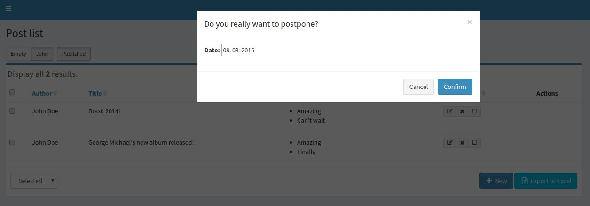

# Modals with additional fields

[go back to Table of contents][back-to-index]

-----

Sometimes, you may need to add a field to modal dialog.
You can simply do it by adding modal with the field:

```twig



  {{ parent() }}
  <div id="confirmObjectModalPostpone" class="modal confirm-object-modal fade" role="dialog">
    <div class="modal-dialog">
      <div class="modal-content">
        <form role="form" action="#" method="post" data-ajax="false">
          <div class="modal-header">
            <button type="button" class="close" data-dismiss="modal">&times;</button>
            <h4 class="modal-title"></h4>
          </div>
          <div class="modal-body">
            <div class="form-group">
              <label for="postpone">Postpone:</label>
              <input type="date" name="postpone"/>
            </div>
          </div>
          <div class="modal-footer">
            <button type="button" class="btn btn-default cancel" data-dismiss="modal">{{ 'action.custom.cancel'|trans({}, "Admingenerator")|raw }}</button>
            <button type="submit" class="btn btn-primary confirm">{{ 'action.custom.confirm'|trans({}, "Admingenerator")|raw }}</button>
        </div>
        </form>
      </div>
    </div>
  </div>

```

In your `YourBundleNameBundle/Resources/config/yourPrefix-generator.yml`

```yaml
params:
    object_actions:
        postpone:
            confirm: Do you really want to postpone?
            confirmModal: confirmObjectModalPostpone
```            

Now you will have the postpone date in POST parameter

```php
  $request->request->get('postpone')
```

Result



[back-to-index]: ../documentation.md