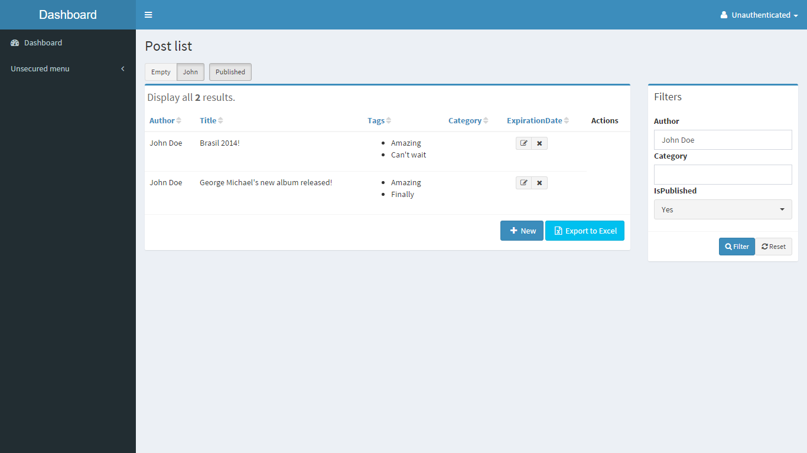
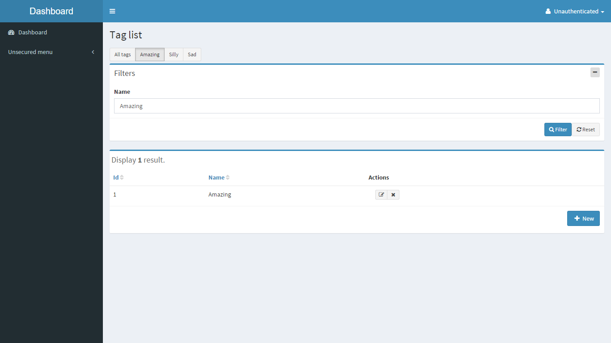
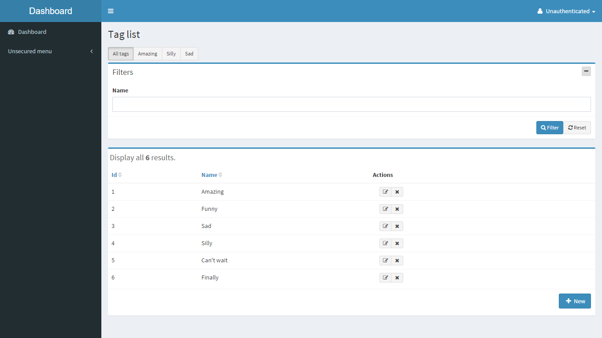
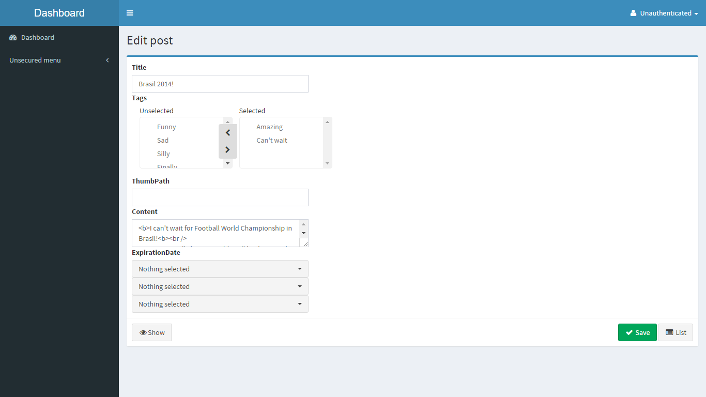

# Documentation
---------------------------------------
This site provides API documentation for latest build of Symfony2 Admin Generator. If you're working with older versions 
we encourage you to update to latest build. If you're getting errors or have trouble with updating see 
[submitting issues][support-issues] and open a ticket on github.

## Table of contents
1. Installation
    - [Base installation][install-base-install]
    - [General configuration][install-general-configuration]
2. Getting started
 	- [Creating an admingenerator][start-create-admin]
 	- [Internationalization][start-internationalization]
3. Model configuration
 	- [General parameters][start-general-params]
 	- [Field configuration][start-field-configuration]
 	- [Action configuration][start-action-configuration]
 	- [Builder configuration][start-builder-configuration]
 	- [List builder][start-list-builder]
 	- [Filters builder][start-filter-builder]
 	- [Edit/new builder][start-edit-builder]
 	- [Excel builder][start-excel-builder]
 	- [Security][start-security]
3. Customization
    - [Action customization][cust-actions]
    - [Form customization][cust-forms]
    - [Template customization][cust-templates]
4. Cookbook
    - [a2lix/TranslationFormBundle integration][cookbook-a2lix]
    - [Breadcrumbs][cookbook-breadcrumbs]
    - [Custom avatars][cookbook-avatar]
    - [KnpMenuBundle][cookbook-menu]
    - [Multiple entity managers (Doctrine)][cookbook-em]
    - [View parameters][cookbook-view-parameters]
    - [Modal with fields][modal-with-fields]
    - [Inject services into form types][inject-services-into-form-types]
5. Support and contribution
    - [Submitting issues][support-issues]
    - [Contributing code][support-contributing]

### Showcase

Below are some screenshots of our very simple demo project.

#### AdminLTE Dashboard

##### List view

##### List view with filter

##### List view with scopes

##### Scoped List view

#### Nested list

##### Edit form

[support-contributing]: support-and-contribution/contributing.md
[support-issues]: support-and-contribution/submitting-issues.md

[install-base-install]: install/base-installation.md
[install-general-configuration]: install/general-configuration.md

[start-create-admin]: getting-started/create-admin.md
[start-internationalization]: getting-started/internationalization.md

[start-general-params]: admin/general-params.md
[start-field-configuration]: admin/fields.md
[start-action-configuration]: admin/actions.md
[start-builder-configuration]: admin/builders.md
[start-list-builder]: admin/builder-list.md
[start-filter-builder]: admin/builder-filter.md
[start-edit-builder]: admin/builder-edit.md
[start-excel-builder]: admin/builder-excel.md
[start-security]: admin/security.md

[cust-actions]: customization/actions.md
[cust-forms]: customization/forms.md
[cust-templates]: customization/templates.md

[cookbook-a2lix]: cookbook/a2lix-translations.md
[cookbook-avatar]: cookbook/custom-avatars.md
[cookbook-breadcrumbs]: cookbook/breadcrumbs.md
[cookbook-em]: cookbook/multiple-entity-managers.md
[cookbook-menu]: cookbook/knp-menu.md
[cookbook-view-parameters]: cookbook/view-parameters.md
[modal-with-fields]: cookbook/modal-with-fields.md
[inject-services-into-form-types]: cookbook/inject-services-into-form-types.md
